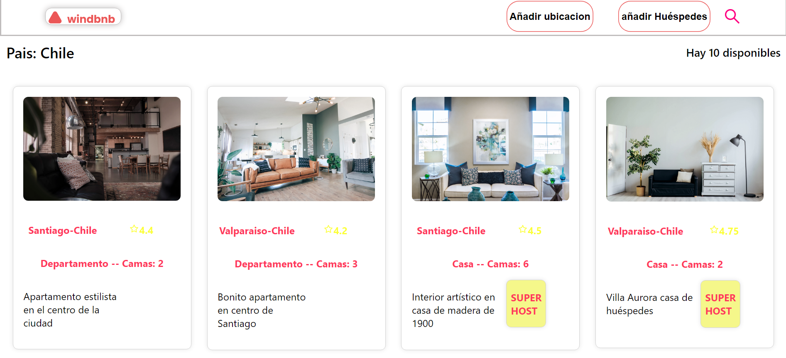

<div align="center">
      <h1> <br/>Windbnb</h1></div>

<div align="center">
   solución para el  challenge de  <a href="http://devchallenges.io" target="_blank">Devchallenges.io</a>.
</div>

## Descripción
Este es un proyecto el cual consiste en crear una página web que muestre una lista de propiedades, con la posibilidad de filtrarlas por ubicación y cantidad de huéspedes. El proyecto fue realizado con React.

<div align="center">
  <h3>
    <a href="https://windbnb-silk.vercel.app/">
      Demo
    </a>
    <span> | </span>
    <a href="https://devchallenges.io/challenges/3JFYedSOZqAxYuOCNmYD">
      Challenge
    </a>
  </h3>
</div>




### Built With
     

## Características
Este programa cuenta con la siguiente lista de características:

- Puedo ver una lista de propiedades
- Puedo ver la tarjeta de propiedad con un nombre, calificación, tipo de departamento y super anfitrión
- Puedo abrir el cajón de filtros
- Puedo filtrar propiedades por ubicación y cantidad de huéspedes
- Puedo ver la cantidad de elementos filtrados
- Puedo ver páginas siguiendo diseños dados


## Como Instalar de manera Local
Para clonar y ejecutar esta aplicación, necesitará [Git](https://git-scm.com) y [Node.js](https://nodejs.org/en/download/) (que viene con [ npm](http://npmjs.com)) instalado en su computadora. Desde su línea de comando:

```bash
# Clone this repository
$ git clone https://github.com/pipetboy2001/...

# Install dependencies
$ npm install

# Run the app
$ npm start
```
## Mi experencia en este challange
Este fue un proyecto muy interesante, ya que me puso aprueba en bastante momentos sobretodo en la creacion del filtrador que fue lo que mas me costo realizar ademas de poner a prueba la obtenecion de datos mediante un archivo mediante la funcion Fetch, aprendi mucho en este proyecto, y me siento muy motivado a seguir aprendiendo y mejorando mis habilidades.